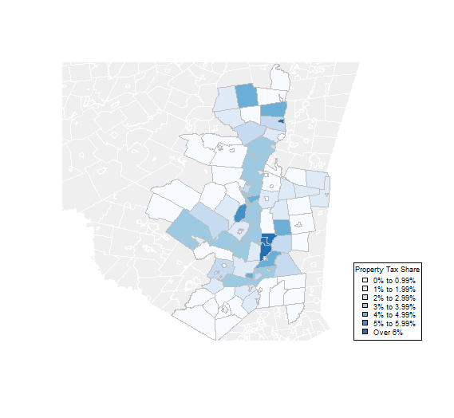

# Central Hudson Gas & Electric Map
by: Mike Silva  
September 30, 2015  

## Introduction
As part of the Central Hudson Gas & Electric project I created a map showing the share of property tax revenue attributable to Central Hudson G&E.  This is the process I used to create the map

## Data Management
First I need to download the shapefiles.  I will be using the 2015 Tiger Files in this project:

```r
download.file('ftp://ftp2.census.gov/geo/tiger/TIGER2015/COUSUB/tl_2015_36_cousub.zip', 'tl_2015_36_cousub.zip')
download.file('ftp://ftp2.census.gov/geo/tiger/TIGER2015/PLACE/tl_2015_36_place.zip', 'tl_2015_36_place.zip')
```

Next I unzip the downloaded files:

```r
unzip('tl_2015_36_cousub.zip')
unzip('tl_2015_36_place.zip')
```
Now I can read in the shapefiles:

```r
library(rgdal)
places <-  readOGR('.','tl_2015_36_place')
```

```
## OGR data source with driver: ESRI Shapefile 
## Source: ".", layer: "tl_2015_36_place"
## with 1196 features
## It has 16 fields
```

```r
county.subdivisions <- readOGR('.', 'tl_2015_36_cousub')
```

```
## OGR data source with driver: ESRI Shapefile 
## Source: ".", layer: "tl_2015_36_cousub"
## with 1023 features
## It has 18 fields
```

Next I read in the property tax data:

```r
df <- read.csv('MapData.csv', colClasses=c('character','character','numeric'))
```
*Note: Due to the confidential nature of this data it will not be included in this repository.*

Now I subset the spatial data frames to only include those county subdivisions and places found in the map data frame:

```r
place <- places[places$GEOID %in% df$GEOID,]
county.subdivision <- county.subdivisions[county.subdivisions$GEOID %in% df$GEOID,]
```

Now I add in the share of property tax column:

```r
place@data = data.frame(place@data, df[match(place@data$GEOID, df$GEOID),])
county.subdivision@data = data.frame(county.subdivision@data, df[match(county.subdivision@data$GEOID, df$GEOID),])
```

I need to change a continuous variable into a discrete one:

```r
place$choropleth <- cut(place$Property.Tax.Share*100, breaks=seq(0,7,1))
county.subdivision$choropleth <- cut(county.subdivision$Property.Tax.Share*100, breaks=seq(0,7,1))
```

## Creating the Choropleth Map

Now I can create our choropleth map:

```r
library(RColorBrewer)
legend.labels <- c('0% to 0.99%','1% to 1.99%','2% to 2.99%', '3% to 3.99%', '4% to 4.99%', '5% to 5.99%','Over 6%')
mypalette <- brewer.pal(8,'Blues')

lon <- as.numeric(as.character(county.subdivision@data$INTPTLON))
lat <- as.numeric(as.character(county.subdivision@data$INTPTLAT))
buffer <- 0.035 # Adding a bit of padding

plot(c(min(lon), max(lon)),c(min(lat)-buffer, max(lat)+buffer),type='n',asp=1.2,axes=FALSE,xlab='',ylab='')
# Add in gray county subdivisions and places
plot(county.subdivisions, add=TRUE, col=c('#efefef'), border='white', lwd=1)
plot(places, add=TRUE, col=c('#efefef'), border='white', lwd=1)
# Add in the chloropleth county subdivisions and places
plot(county.subdivision, col=mypalette[as.numeric(county.subdivision$choropleth)],add=TRUE, border='gray',lwd=1)
plot(place, col=mypalette[as.numeric(place$choropleth)], add=TRUE, border='gray', lwd=1)
# Add in the legend
legend('bottomright', legend = legend.labels, title = 'Property Tax Share', fill = mypalette, cex = 0.56)
```

 
